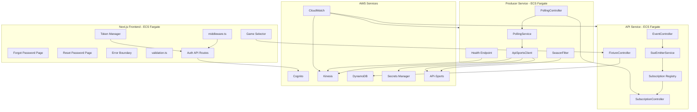
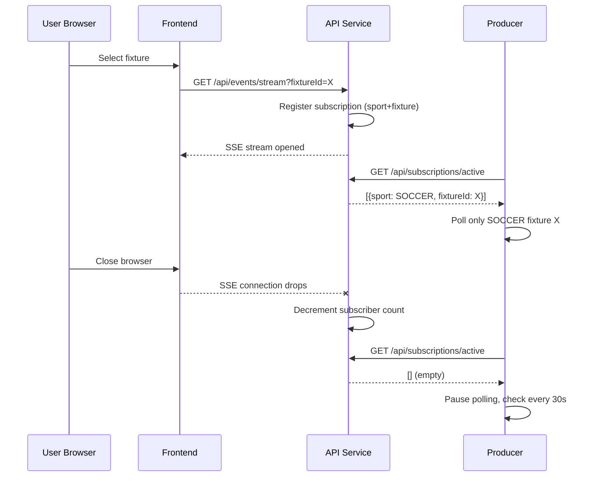

# Technical Design Document: App Completion Hardening

## Overview

This design covers the final 20% of GameShift Live — completing the application from a functional prototype into a production-ready sports telemetry platform. The scope spans 15 requirements across authentication flows, middleware activation, validation utilities, token lifecycle management, test coverage, health monitoring, CI/CD hardening, error resilience, live API connection, intelligent sport filtering, per-game fixture selection, and session-aware polling.

The design follows the existing architecture patterns: Spring Boot 3 / Java 21 services on ECS Fargate, a Java 21 Lambda Kinesis consumer, Next.js 16 frontend with server-side API routes, Terraform infrastructure modules, and GitHub Actions CI/CD.

**Key Design Principles:**
- Minimal new infrastructure — extend existing Terraform modules rather than creating new services
- Consistent patterns — follow the established `cognito.ts` + API routes + sessions pattern for auth flows
- Backward-compatible — new features (fixture filtering, session-aware polling) degrade gracefully when optional parameters are absent
- Cost-aware — season filtering and session-aware polling directly reduce API-Sports quota consumption

## Architecture

### High-Level Data Flow (Extended)



### Component Interaction for Session-Aware Polling



## Components and Interfaces

### 1. Frontend Authentication Components

#### Forgot Password Page (`/forgot-password`)
- **File:** `frontend/src/app/(auth)/forgot-password/page.tsx`
- **Behavior:** Form with email input → calls `/api/auth/email/forgot-password` → redirects to `/reset-password` with email in query param

#### Reset Password Page (`/reset-password`)
- **File:** `frontend/src/app/(auth)/reset-password/page.tsx`
- **Behavior:** Form with code + new password → calls `/api/auth/email/reset-password` → redirects to `/login` on success
- **Guard:** If no `email` query param present, redirect to `/forgot-password`

#### Auth API Routes (New)
- **`/api/auth/email/forgot-password/route.ts`** — POST: invokes `ForgotPasswordCommand`, returns generic success regardless of user existence
- **`/api/auth/email/reset-password/route.ts`** — POST: invokes `ConfirmForgotPasswordCommand`, returns specific error for code mismatch/expiry
- **`/api/auth/email/resend-code/route.ts`** — POST: invokes `ResendConfirmationCodeCommand`, returns generic error for user-not-found

#### Cognito Library Extensions (`frontend/src/lib/cognito.ts`)
```typescript
// New exports to add:
export async function forgotPassword(email: string): Promise<void>;
export async function confirmForgotPassword(email: string, code: string, newPassword: string): Promise<void>;
export async function resendConfirmationCode(email: string): Promise<void>;
export async function refreshToken(refreshToken: string): Promise<AuthenticationResultType>;
```

### 2. Middleware Activation

- **Action:** Rename `frontend/src/proxy.ts` → `frontend/src/middleware.ts`
- **Change:** Rename exported function from `proxy` to `middleware`
- **Matcher:** Already correctly configured: `['/((?!api|_next/static|_next/image|favicon.ico).*)']`

### 3. Validation Utility

- **File:** `frontend/src/lib/validation.ts`

```typescript
interface ValidationError {
  field: string;
  rule: string;
  message: string;
}

interface ValidationResult {
  success: boolean;
  errors: ValidationError[];
}

export function validateEmail(email: string): ValidationResult;
export function validatePassword(password: string): ValidationResult;
```

**Email Rules:**
- Exactly one `@` character
- Local part: 1–64 characters
- Domain part: contains at least one `.`, each label 1–63 characters
- Total length ≤ 254

**Password Rules (matching Cognito policy):**
- Length: 8–256 characters
- At least one uppercase (A-Z)
- At least one lowercase (a-z)
- At least one digit (0-9)
- At least one special character from: `^ $ * . [ ] { } ( ) ? " ! @ # % & / \ , > < ' : ; | _ ~ \` = + -`

### 4. Token Manager

- **File:** `frontend/src/lib/tokenManager.ts`

**Architecture Decision:** The token refresh logic lives in an API route (`/api/auth/refresh/route.ts`) that uses the server-side Cognito SDK. The client-side Token Manager is a fetch wrapper that intercepts 401 responses and coordinates refresh calls.

```typescript
// Client-side wrapper
export function createAuthFetch(): typeof fetch;
```

**Session Cookie Changes:** Store both access token and refresh token in the session cookie (as a JSON-encoded object). The existing `sessions.ts` `createSession` function updates to accept `{ accessToken, refreshToken }`.

**Proactive refresh:** On each API call, decode the JWT `exp` claim client-side. If < 5 minutes remain, trigger a background refresh before the request.

**Queuing:** A single `refreshPromise` variable ensures concurrent 401 responses don't trigger multiple refresh calls.

### 5. Lambda Processor Tests

- **File:** `lambda/src/test/java/live/gameshift/lambda/SportEventHandlerTest.java`
- **Dependencies:** Add JUnit 5 + Mockito to `lambda/pom.xml`
- **Strategy:** Mock `DynamoDbService` and `BedrockCommentaryService`, inject via a test-visible constructor

```java
// Test-visible constructor for dependency injection
public SportEventHandler(ObjectMapper objectMapper, DynamoDbService dynamoDbService, BedrockCommentaryService bedrockService) {
    this.objectMapper = objectMapper;
    this.dynamoDbService = dynamoDbService;
    this.bedrockService = bedrockService;
}
```

**Test Cases:**
- Valid payload deserialization → correct SportEvent fields
- Event persisted to DynamoDB with correct field mapping
- Summary persisted with generated commentary
- 6 sport types → distinct prompts
- Bedrock failure → Event still persisted, fallback commentary used
- Malformed JSON → error logged, next record processed
- Multi-record batch → independent processing

### 6. Frontend Test Setup

- **Config:** `frontend/vitest.config.ts` with jsdom environment, path alias `@/` → `./src/`
- **Dependencies:** `vitest`, `@testing-library/react`, `@testing-library/jest-dom`, `jsdom`
- **Script:** `"test": "vitest --run"`

**Test Files:**
- `frontend/src/lib/__tests__/useEventBuffer.test.ts`
- `frontend/src/lib/__tests__/validation.test.ts`
- `frontend/src/app/(auth)/__tests__/login.test.tsx`

### 7. Producer Health Endpoint

The producer already includes `spring-boot-starter-actuator` with `/actuator/health` exposed. The existing Terraform health check references port 8080, but the producer runs on **port 8081**.

**Changes Required:**
1. Update Terraform ECS health check: port `8080` → `8081` in the curl command
2. Add a custom `HealthIndicator` for Kinesis connectivity:

```java
@Component
public class KinesisHealthIndicator implements HealthIndicator {
    @Override
    public Health health() {
        // Try kinesisClient.describeStream() — return DOWN on failure
    }
}
```

3. When Kinesis is unreachable, Actuator returns 503 with `{"status": "DOWN"}`

### 8. CloudWatch Monitoring (Terraform Module)

- **New module:** `infrastructure/modules/monitoring/main.tf`
- **Resources:**
  - `aws_sns_topic` — alarm notifications
  - `aws_cloudwatch_metric_alarm` — Lambda error rate (Errors/Invocations > 5%, 5-min period, 1 datapoint)
  - `aws_cloudwatch_metric_alarm` — ECS RunningTaskCount == 0 for each service (1-min period, 2 datapoints)
  - `aws_cloudwatch_metric_alarm` — Kinesis IteratorAgeMilliseconds max > 60000 (1-min period)
  - `aws_cloudwatch_dashboard` — Lambda metrics, ECS CPU/memory, Kinesis IncomingRecords, DynamoDB capacity units

### 9. CI/CD Pipeline Hardening

**Updated `deploy.yml` structure:**
1. **test** job: Run `mvn test` for lambda, api, producer; `npm run test` for frontend
2. **plan** job: `terraform plan -var-file=dev.tfvars`, output to workflow summary
3. **build-deploy** job (depends on test): Docker build + push, Lambda deploy, ECS force-new-deployment

If any test fails, the pipeline halts — subsequent jobs have `needs: [test]`.

### 10. Frontend Error Boundaries + Loading States

- **Error Boundary:** `frontend/src/components/ErrorBoundary.tsx` — class component wrapping dashboard, catches render errors, shows fallback with "Retry" button (calls `window.location.reload()`)
- **Loading Skeletons:** `frontend/src/components/dashboard/EventFeedSkeleton.tsx` and `CommentaryPanelSkeleton.tsx` — animated placeholder divs with matching dimensions
- **SSE Reconnection:** Modify `useEventBuffer.ts` to implement exponential backoff (1s → 2s → 4s → ... → 30s cap, 10 attempts max), expose `reconnectionState` for the UI to show a banner

### 11. Live API-Sports Connection

- **Config change:** Set `app.api.sports.mock-mode=false` in the ECS task definition environment (via Terraform variable)
- **SecretsService:** Already reads from Secrets Manager when mock mode is off — no code change needed
- **HTTP timeouts:** Add to `ApiSportsClient` RestClient builder: `.requestTimeout(Duration.ofSeconds(10))`
- **Rate limiting:** In `ApiSportsClient.fetchLatestEvent()`, catch HTTP 429 → set per-sport `pausedUntil` timestamp, skip for 60 seconds
- **Auth/server errors:** Catch 401/403/5xx → log sport + endpoint + status, return `Optional.empty()`, continue next cycle

### 12. Seasonal Sport Filtering

- **New class:** `producer/src/main/java/live/gameshift/producer/service/SeasonFilterService.java`
- **Behavior:** At startup + daily (00:00 UTC via `@Scheduled(cron = "0 0 0 * * *")`), query each sport's fixtures endpoint for the next 24 hours
- **Storage:** `Map<SportType, Boolean> activeSports` — volatile, updated atomically
- **PollingService change:** Before polling a sport, check `seasonFilterService.isActive(sportType)`
- **API Service endpoint:** New `GET /api/sports/active` returns the list of active sport types
- **Frontend change:** Dashboard sport selector fetches `/api/sports/active` and only renders active sports

### 13. Per-Game Fixture Selection

**Producer Changes:**
- Add `fixtureId` field to `SportEvent` model (the API-Sports fixture ID, already available in the normalized response)
- `SoccerNormalizer` extracts `fixture.fixture.id` from the API-Sports response

**API Service Changes:**
- New `GET /api/fixtures?sport={sportType}` endpoint → queries DynamoDB or caches API-Sports fixture list
- `GET /api/events/stream` accepts optional `?fixtureId=X` query param
- `SseEmitterService` upgraded: each emitter stores metadata (sport, fixtureId) for targeted broadcasting
- `EventService.pollForNewEvents()` sends events only to matching emitters

**Frontend Changes:**
- New `FixtureList` component — shows participants, status (live/scheduled/finished), start time
- Dashboard flow: select sport → show fixture list → select fixture → open SSE stream with `fixtureId` param
- No fixture selected → show prompt, no SSE connection opened

### 14. Session-Aware Polling

**API Service:**
- `SubscriptionRegistry` class: `ConcurrentHashMap<String, AtomicInteger>` keyed by `sport:fixtureId`
- Increment on SSE connection open, decrement on close/timeout/error
- `GET /api/subscriptions/active` returns entries with count > 0
- Heartbeat timeout: if no client ping within 120s, close the emitter and decrement

**Producer Service:**
- `PollingController` class: before each poll cycle, call API service `/api/subscriptions/active`
- If response is empty → sleep 30s, check again
- If endpoint unreachable → use previous cycle's sport/fixture list, log warning
- Only poll sports/fixtures with active subscribers

## Data Models

### Extended SportEvent (Producer)

```java
public class SportEvent {
    private String eventId;
    private SportType sportType;
    private String action;
    private Map<String, String> participants;
    private String rawPayload;
    private Long eventTimestamp;
    private String fixtureId;  // NEW: API-Sports fixture ID
}
```

### Extended Event (API DynamoDB Model)

```java
@DynamoDbBean
public class Event {
    // existing fields...
    private String fixtureId;  // NEW: stored for fixture-level filtering
}
```

### Session Cookie Structure (Updated)

```typescript
interface SessionData {
  accessToken: string;
  refreshToken: string;
  expiresAt: number; // epoch seconds from JWT exp claim
}
```

### Subscription Registry Entry

```java
public record SubscriptionEntry(SportType sportType, String fixtureId, int subscriberCount) {}
```

### Validation Result

```typescript
interface ValidationError {
  field: string;
  rule: string;
  message: string;
}

interface ValidationResult {
  success: boolean;
  errors: ValidationError[];
}
```

## Correctness Properties

*A property is a characteristic or behavior that should hold true across all valid executions of a system — essentially, a formal statement about what the system should do. Properties serve as the bridge between human-readable specifications and machine-verifiable correctness guarantees.*

### Property 1: Email validation correctness

*For any* string that contains exactly one "@" with a local part of 1–64 characters, a domain with at least one "." where each label is 1–63 characters, and a total length ≤ 254, the email validator SHALL return `success: true` with an empty errors array. *For any* string that violates any of these rules, the validator SHALL return `success: false` with at least one error in the array.

**Validates: Requirements 4.1**

### Property 2: Password validation correctness

*For any* string of 8–256 characters containing at least one uppercase letter, one lowercase letter, one digit, and one special character from the allowed set, the password validator SHALL return `success: true`. *For any* string that violates any of these rules, the validator SHALL return `success: false` with errors identifying each violated rule.

**Validates: Requirements 4.2**

### Property 3: Validation reports all failures simultaneously

*For any* input that violates N distinct validation rules (where N > 1), the validator SHALL return exactly N error objects in the errors array, each identifying a different failed rule.

**Validates: Requirements 4.4**

### Property 4: Event buffer time-travel filtering

*For any* list of events with timestamps and any non-negative offset value in seconds, the visible events returned by `useEventBuffer` SHALL include only events whose `eventTimestamp` is at least `offsetSeconds` older than the current time, and SHALL exclude all events newer than that threshold.

**Validates: Requirements 7.2**

### Property 5: Subscription registry count invariant

*For any* sequence of SSE connect and disconnect operations on arbitrary sport/fixture combinations, the subscription registry count for each combination SHALL equal the number of connects minus the number of disconnects for that combination, and SHALL never fall below zero.

**Validates: Requirements 15.1, 15.2, 15.3**

### Property 6: Lambda batch independence

*For any* Kinesis batch containing N records where K records have malformed JSON (at arbitrary positions in the batch), the Lambda handler SHALL successfully process and persist exactly (N - K) events to DynamoDB, independent of the ordering of valid and malformed records.

**Validates: Requirements 6.7, 6.8**

### Property 7: Season filter partitions sports correctly

*For any* set of configured sports where a subset has fixtures within the next 24 hours (as determined by API-Sports), the Season Filter SHALL mark exactly that subset as active and exclude the remainder from polling. When a previously inactive sport gains fixtures, it SHALL transition to active on the next check.

**Validates: Requirements 13.1, 13.2, 13.3**

### Property 8: Fixture-filtered SSE stream delivers only matching events

*For any* SSE connection subscribed to a specific fixtureId, all events delivered through that connection SHALL have a fixtureId matching the subscribed value. No event with a different fixtureId SHALL be delivered to that connection.

**Validates: Requirements 14.2, 14.3**

## Error Handling

### Frontend Auth Flows
| Error | Source | Handling |
|-------|--------|----------|
| `UserNotFoundException` | Cognito (forgot-password) | Return generic success (security: don't reveal user existence) |
| `LimitExceededException` | Cognito (forgot-password/resend) | Return generic success or generic error |
| `CodeMismatchException` | Cognito (reset-password) | Return 400 with "Invalid or expired code" |
| `ExpiredCodeException` | Cognito (reset-password) | Return 400 with "Code has expired, request a new one" |
| `CodeDeliveryFailureException` | Cognito (resend) | Return 500 with "Could not send code" |
| `NotAuthorizedException` | Cognito (token refresh) | Clear session, redirect to `/login` |

### Producer Error Handling
| Error | Source | Handling |
|-------|--------|----------|
| HTTP 429 | API-Sports | Pause sport for 60s, log warning |
| HTTP 401/403 | API-Sports | Log error with sport + endpoint + status, skip sport this cycle |
| HTTP 5xx | API-Sports | Log error, skip sport this cycle, retry next cycle |
| Secret retrieval failure | Secrets Manager | Fail startup with clear error message |
| Season check timeout | API-Sports | Retain previous active/inactive status, log warning |
| Subscription endpoint unreachable | API Service | Use previous cycle's sport/fixture list, log warning |

### Frontend Resilience
| Scenario | Handling |
|----------|----------|
| Render error (React crash) | Error boundary catches, shows fallback + Retry button |
| SSE disconnect | Exponential backoff: 1s → 2s → 4s → ... → 30s cap, 10 attempts |
| All reconnection attempts fail | Show persistent error + manual "Reconnect" button |
| Token expired (401) | Queue requests, refresh once, retry all queued |
| Refresh fails (network) | Retry once after 2s, then clear session → `/login` |
| Fixture list fetch fails | Show error message with retry button |

## Testing Strategy

### Unit Tests (Example-Based)

**Lambda (JUnit 5 + Mockito):**
- Valid payload deserialization
- Event persistence field mapping
- Summary persistence with generated commentary
- Per-sport prompt differentiation (6 tests)
- Bedrock failure fallback
- Malformed JSON handling
- Multi-record batch independence
- Target: ≥80% line coverage on handler, services, repositories

**Frontend (Vitest + React Testing Library):**
- `useEventBuffer`: offset filtering, exclusion of new events, buffer cap at 500
- `validation.ts`: valid/invalid email formats, short/valid passwords, multiple simultaneous failures
- Login form: calls API endpoint, renders error on failure, disables button during submission

**API (JUnit 5 + MockMvc):**
- SubscriptionRegistry increment/decrement correctness
- Fixture endpoint filtering
- SSE stream with fixtureId filtering

**Producer (JUnit 5 + Mockito):**
- SeasonFilter active/inactive determination
- PollingController subscription check integration
- Rate limit (429) pause behavior
- Health indicator Kinesis connectivity

### Property-Based Tests (Vitest + fast-check)

Property-based testing is applicable to the validation utility and event buffer logic — these are pure functions with clear input/output behavior and large input spaces.

**Library:** `fast-check` (TypeScript property-based testing library for Vitest)
**Configuration:** Minimum 100 iterations per property test
**Tag format:** `Feature: app-completion-hardening, Property {N}: {description}`

**Property tests to implement:**
1. Email validation correctness (Property 1) — generate valid/invalid emails, verify accept/reject
2. Password validation correctness (Property 2) — generate compliant/non-compliant passwords
3. All-failures reporting (Property 3) — generate inputs with multiple rule violations
4. Event buffer time filtering (Property 4) — generate event lists + offsets, verify filtering
5. Subscription registry invariant (Property 5) — generate connect/disconnect sequences
6. Lambda batch independence (Property 6) — generate batches with mixed valid/invalid records

### Integration Tests
- CloudWatch alarms: verify alarm exists with correct thresholds (Terraform plan output)
- CI/CD: verify test gate halts on failure (workflow syntax validation)
- Middleware: verify protected routes redirect unauthenticated requests

### Infrastructure Tests (Terraform)
- `terraform validate` — syntax correctness
- `terraform plan` — no unexpected resource deletions
- Monitoring module creates expected alarm count
