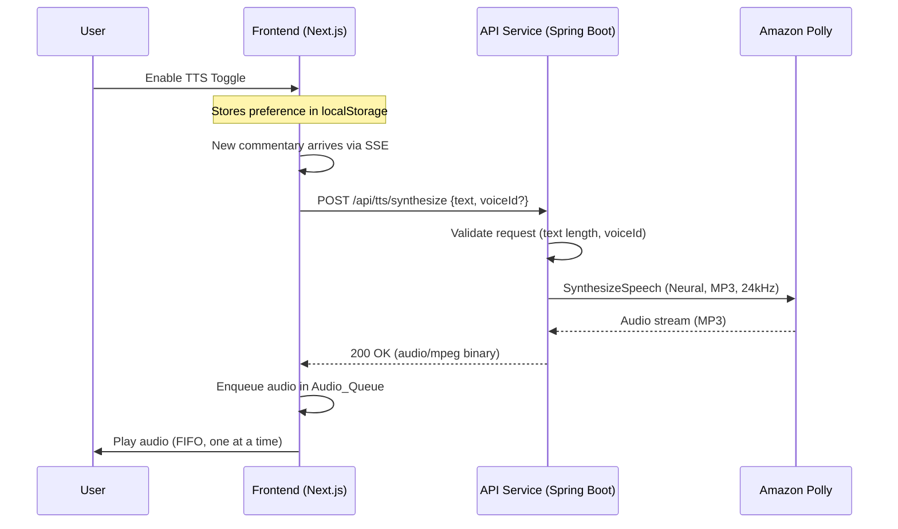

# Design Document: Polly Commentary TTS

## Overview

This feature adds text-to-speech (TTS) capabilities to the GameShift Live commentary system. The API Service (Spring Boot) gains a new endpoint that accepts commentary text and returns synthesized audio via Amazon Polly's neural engine. The Frontend (Next.js) adds a toggle, an audio queue, and playback controls so users can listen to AI commentary as it arrives in real time.

The design follows the existing architecture: the API Service acts as the intermediary to AWS services (just as it does for DynamoDB), and the frontend consumes a simple REST endpoint. No WebSocket or streaming changes are needed — the frontend requests audio on demand when new commentary arrives.

## Architecture



**Key architectural decisions:**

1. **Synchronous REST endpoint** rather than pre-generating audio: Commentary text is short (< 3000 chars) and Polly neural synthesis is fast (~1-3s). A simple POST/response pattern avoids the complexity of background jobs, S3 storage, and polling.

2. **No audio caching on the server**: Each commentary is unique event text. Caching would add storage/invalidation complexity with minimal benefit since the same commentary is unlikely to be requested twice.

3. **Frontend-driven queue**: The browser manages playback sequencing. This keeps the server stateless and allows individual users to control their own playback without server coordination.

4. **API Service as Polly proxy**: The frontend cannot call Polly directly (IAM credentials are on the ECS task role). Routing through the API Service also provides input validation, rate limiting opportunity, and a single point for error handling.

## Components and Interfaces

### Backend Components

#### TtsController (`api/src/main/java/live/gameshift/api/controller/TtsController.java`)

REST controller exposing the `/api/tts/synthesize` endpoint.

```java
@RestController
@RequestMapping("/api/tts")
public class TtsController {
    
    private final TtsService ttsService;

    @PostMapping(value = "/synthesize", produces = "audio/mpeg")
    public ResponseEntity<byte[]> synthesize(@RequestBody TtsSynthesizeRequest request) {
        // Delegates validation and synthesis to TtsService
    }
}
```

#### TtsService (`api/src/main/java/live/gameshift/api/service/TtsService.java`)

Service layer encapsulating validation logic and Polly client invocation.

```java
@Service
public class TtsService {
    
    private static final Set<String> SUPPORTED_VOICES = Set.of("Matthew", "Joanna", "Liam", "Ruth");
    private static final String DEFAULT_VOICE = "Matthew";
    private static final int MAX_TEXT_LENGTH = 3000;

    private final PollyClient pollyClient;

    public byte[] synthesize(String text, String voiceId) {
        // 1. Validate text (non-empty, <= 3000 chars)
        // 2. Resolve voiceId (default to Matthew if null)
        // 3. Validate voiceId against SUPPORTED_VOICES
        // 4. Call Polly SynthesizeSpeech with Neural engine, MP3, 24kHz
        // 5. Return audio bytes
    }
}
```

#### TtsSynthesizeRequest DTO (`api/src/main/java/live/gameshift/api/dto/TtsSynthesizeRequest.java`)

```java
public record TtsSynthesizeRequest(String text, String voiceId) {}
```

#### PollyClient Bean (added to `AwsConfig.java`)

```java
@Bean
public PollyClient pollyClient() {
    return PollyClient.builder()
            .region(Region.of(awsRegion))
            .overrideConfiguration(config -> config
                .apiCallTimeout(Duration.ofSeconds(10)))
            .build();
}
```

### Frontend Components

#### TtsToggle (`frontend/src/components/dashboard/TtsToggle.tsx`)

A button component in the CommentaryPanel header. Manages enabled/disabled state, persists to localStorage, and communicates state to the audio queue hook.

#### useAudioQueue hook (`frontend/src/lib/useAudioQueue.ts`)

Custom React hook managing the audio playback queue.

```typescript
interface AudioQueueState {
  queue: AudioSegment[];       // max 5 pending segments
  currentlyPlaying: AudioSegment | null;
  isPlaying: boolean;
}

interface AudioSegment {
  id: string;
  text: string;               // original commentary text (for dedup)
  audioBlob: Blob;            // MP3 audio data
}

function useAudioQueue(enabled: boolean): {
  enqueue: (text: string, audioBlob: Blob) => void;
  skip: () => void;
  stopAll: () => void;
  state: AudioQueueState;
}
```

#### useTtsPreference hook (`frontend/src/lib/useTtsPreference.ts`)

Manages the TTS toggle state with localStorage persistence.

```typescript
function useTtsPreference(): {
  enabled: boolean;
  toggle: () => void;
}
```

#### PlaybackControls (`frontend/src/components/dashboard/PlaybackControls.tsx`)

Renders Skip, Stop All, or Play Next buttons based on current queue state.

#### Updated CommentaryPanel

The existing `CommentaryPanel.tsx` is extended to:
1. Include the `TtsToggle` in its header
2. Use the `useAudioQueue` hook
3. Automatically synthesize and enqueue new commentary when TTS is enabled

### API Interface

**POST /api/tts/synthesize**

Request:
```json
{
  "text": "Goal! Rodriguez scores with a brilliant header!",
  "voiceId": "Matthew"
}
```

Response (success): `200 OK`, Content-Type: `audio/mpeg`, body: binary MP3 data

Response (validation error): `400 Bad Request`
```json
{
  "error": "Text exceeds maximum length of 3000 characters"
}
```

Response (service unavailable): `503 Service Unavailable`
```json
{
  "error": "Speech synthesis is temporarily unavailable"
}
```

## Data Models

### Backend

| Class | Fields | Purpose |
|-------|--------|---------|
| `TtsSynthesizeRequest` | `text: String`, `voiceId: String` | Inbound request DTO |
| `TtsErrorResponse` | `error: String` | Error response body |

No database tables are needed. Audio is generated on-the-fly and streamed directly to the client.

### Frontend

| Type | Fields | Purpose |
|------|--------|---------|
| `AudioSegment` | `id: string`, `text: string`, `audioBlob: Blob` | Single queued audio item |
| `AudioQueueState` | `queue: AudioSegment[]`, `currentlyPlaying: AudioSegment \| null`, `isPlaying: boolean` | Queue state |
| `TtsPreference` | `enabled: boolean` | Persisted in localStorage under key `gameshift-tts-enabled` |

### Polly Request Parameters (constants)

| Parameter | Value | Rationale |
|-----------|-------|-----------|
| Engine | `neural` | High-quality, natural-sounding speech |
| OutputFormat | `mp3` | Widely supported by browsers |
| SampleRate | `24000` | High quality for neural voices |
| TextType | `text` | Plain text input (no SSML) |
| Default VoiceId | `Matthew` | US English male, suitable for sports broadcasting |

## Correctness Properties

*A property is a characteristic or behavior that should hold true across all valid executions of a system — essentially, a formal statement about what the system should do. Properties serve as the bridge between human-readable specifications and machine-verifiable correctness guarantees.*

### Property 1: Valid request produces correct Polly invocation

*For any* valid commentary text (1 to 3000 characters, non-blank) and *for any* voiceId in {Matthew, Joanna, Liam, Ruth, null}, the TtsService SHALL invoke Polly with engine=NEURAL, outputFormat=MP3, sampleRate=24000, textType=TEXT, and voiceId equal to the provided value (or "Matthew" if null), and return the Polly audio bytes.

**Validates: Requirements 1.2, 1.3, 6.1, 6.2, 6.4, 6.5**

### Property 2: Invalid text is rejected

*For any* text string that is null, empty, composed entirely of whitespace, or exceeds 3000 characters, the TtsService SHALL reject the request with an appropriate error without invoking the Polly client.

**Validates: Requirements 1.4, 1.5**

### Property 3: Invalid voiceId is rejected

*For any* voiceId string that is not in the set {Matthew, Joanna, Liam, Ruth}, the TtsService SHALL reject the request with an appropriate error without invoking the Polly client.

**Validates: Requirements 1.8, 6.3**

### Property 4: Polly failure produces service unavailable

*For any* valid synthesis request, if the Polly client throws any exception (service error, timeout, network failure), the TtsService SHALL return a service unavailable indication without propagating the exception.

**Validates: Requirements 1.6, 6.6**

### Property 5: TTS preference localStorage round-trip

*For any* boolean TTS preference value, persisting it to localStorage and then reading it back SHALL produce the original value.

**Validates: Requirements 2.4**

### Property 6: Audio queue FIFO ordering

*For any* sequence of audio segments enqueued while playback is active, the segments SHALL be played back in exactly the order they were enqueued (first-in, first-out).

**Validates: Requirements 3.2, 4.1**

### Property 7: Audio queue deduplication

*For any* text string that is identical to the text currently playing or any text already present in the audio queue, attempting to enqueue it SHALL not modify the queue state.

**Validates: Requirements 3.5**

### Property 8: Audio queue capacity invariant

*For any* sequence of enqueue operations, the number of pending (non-playing) segments in the audio queue SHALL never exceed 5. When a segment arrives and the queue is full, the oldest pending segment SHALL be discarded to make room.

**Validates: Requirements 4.3**

## Error Handling

### Backend (TtsService)

| Scenario | HTTP Status | Response | Behavior |
|----------|-------------|----------|----------|
| Empty/blank text | 400 | `{"error": "Commentary text is required"}` | No Polly call |
| Text > 3000 chars | 400 | `{"error": "Text exceeds maximum length of 3000 characters"}` | No Polly call |
| Invalid voiceId | 400 | `{"error": "Unsupported voice. Supported voices: Matthew, Joanna, Liam, Ruth"}` | No Polly call |
| Malformed JSON body | 400 | `{"error": "Request body is malformed"}` | Spring framework handles parsing |
| Polly service error | 503 | `{"error": "Speech synthesis is temporarily unavailable"}` | Log error, return 503 |
| Polly timeout (>10s) | 503 | `{"error": "Speech synthesis is temporarily unavailable"}` | Timeout configured on client |
| Missing IAM permission | 503 | `{"error": "Speech synthesis is unavailable"}` | Polly throws AccessDeniedException |

### Frontend (Audio Queue)

| Scenario | Behavior |
|----------|----------|
| Synthesis request fails (network/timeout/non-2xx) | Skip that commentary; log warning to console; continue playing current + queue |
| Audio decoding error | Discard segment; log warning; advance to next in queue |
| Browser blocks autoplay | Audio will not play until user interaction; queue accumulates |
| localStorage unavailable | Default TTS to off; preference not persisted |

## Testing Strategy

### Backend Testing

**Unit Tests (JUnit 5 + Mockito):**
- TtsController endpoint mapping and content type
- TtsService validation logic (empty text, text length, voiceId validation)
- TtsService Polly client interaction (mock PollyClient)
- Error response formatting
- Polly client timeout configuration

**Property-Based Tests (jqwik):**
- Property 1: Generate random valid text (1-3000 chars) and valid/null voiceIds → verify correct Polly invocation parameters
- Property 2: Generate invalid text (empty, whitespace-only, >3000 chars) → verify rejection without Polly call
- Property 3: Generate random strings not in valid voice set → verify rejection
- Property 4: Generate valid requests with mocked Polly failures (random exception types) → verify 503 response

**Configuration:**
- Minimum 100 iterations per property test
- Each test tagged with: `@Tag("Feature: polly-commentary-tts, Property {N}: {title}")`
- PollyClient mocked in all property tests (no real AWS calls)

### Frontend Testing

**Unit Tests (Vitest + Testing Library):**
- TtsToggle renders with correct aria attributes in both states
- TtsToggle click toggles state and invokes callbacks
- PlaybackControls shows/hides buttons based on queue state
- CommentaryPanel integration with TTS components

**Property-Based Tests (fast-check):**
- Property 5: Generate random boolean values → verify localStorage round-trip
- Property 6: Generate random sequences of audio segment arrivals → verify FIFO playback order
- Property 7: Generate queue states and duplicate text → verify deduplication
- Property 8: Generate enqueue sequences of varying lengths → verify queue never exceeds 5 pending

**Configuration:**
- Minimum 100 iterations per property test (`fc.assert(property, { numRuns: 100 })`)
- Each test annotated with comment: `// Feature: polly-commentary-tts, Property {N}: {title}`

### Integration Tests

- End-to-end test of POST `/api/tts/synthesize` with mocked Polly (Spring MockMvc)
- Terraform plan validation that Polly IAM policy is attached to the API task role

### Infrastructure Validation

- Verify `pom.xml` includes `software.amazon.awssdk:polly` dependency
- Verify Terraform IAM policy grants only `polly:SynthesizeSpeech`
