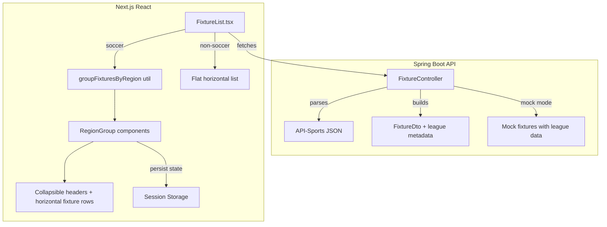

# Design Document: Soccer Fixtures Region Grouping

## Overview

This feature transforms the soccer fixtures display from a flat horizontal list into a structured, region-grouped vertical layout. The backend extracts league and country metadata from the API-Sports response and exposes it via `FixtureDto`. The frontend uses this metadata to group soccer fixtures into collapsible, alphabetically sorted regional sections (e.g., "England - Premier League"), each containing a horizontal scrollable row of fixture cards. Non-soccer sports retain the existing flat layout.

The change is scoped to:
1. **Backend**: Extend `FixtureDto` with `leagueName` and `country` fields; extract values from the API-Sports JSON `league` object during parsing; provide realistic mock data.
2. **Frontend**: Implement grouping logic, collapsible region headers with session-storage persistence, and a vertical-stack layout with horizontal-scroll rows per group.

## Architecture



**Key architectural decisions:**

1. **Grouping logic lives in the frontend** — The backend returns a flat list of fixtures with metadata. The frontend performs grouping and sorting. This keeps the API simple, cacheable, and reusable for other consumers that may not need grouping.

2. **Pure utility function for grouping** — The grouping/sorting logic is extracted into a pure function (`groupFixturesByRegion`) separate from the React component. This enables thorough property-based testing without DOM dependencies.

3. **Session storage for collapse state** — Using `sessionStorage` means state persists across in-app navigation but resets when the tab closes, avoiding stale state across sessions.

## Components and Interfaces

### Backend

#### FixtureDto (modified)

```java
public record FixtureDto(
    String fixtureId,
    SportType sportType,
    Map<String, String> participants,
    String status,
    Long startTime,
    String leagueName,  // NEW
    String country      // NEW
) {}
```

#### FixtureController (modified)

- `parseFixturesResponse()` — Extended to extract `league.name` and `league.country` from each fixture node in the API-Sports JSON. Applies defaults ("Unknown League", "International") for null/blank/missing values.
- `getMockFixtures()` — Updated to include realistic league/country values for soccer fixtures (e.g., "Premier League"/"England", "Champions League"/"World").

### Frontend

#### `groupFixturesByRegion(fixtures: Fixture[]): RegionGroup[]`

Pure utility function in `src/lib/fixtureGrouping.ts`:

```typescript
interface Fixture {
    fixtureId: string;
    sportType: string;
    participants: Record<string, string>;
    status: string;
    startTime: number;
    leagueName?: string;
    country?: string;
}

interface RegionGroup {
    label: string;       // "Country - League Name"
    fixtures: Fixture[]; // sorted by startTime ascending
}

function groupFixturesByRegion(fixtures: Fixture[]): RegionGroup[];
```

- Groups fixtures by `"${country} - ${leagueName}"` label
- Defaults missing `country` to `"International"` and missing `leagueName` to `"Unknown League"`
- Sorts groups alphabetically (case-insensitive) by label
- Sorts fixtures within each group by `startTime` ascending

#### `RegionGroupHeader` component

Renders the collapsible header for each group:
- Shows group label and fixture count when collapsed
- Toggles expand/collapse on click, Enter, or Space
- Visual expand/collapse indicator (chevron icon)

#### `FixtureList.tsx` (modified)

- For `sport === "SOCCER"`: calls `groupFixturesByRegion`, renders vertical stack of `RegionGroupHeader` + horizontal fixture rows
- For other sports: renders existing flat horizontal list unchanged
- Manages collapse state via `sessionStorage` keyed by group label
- Constrains container height to 600px max with vertical scroll

## Data Models

### API-Sports Response Structure (relevant subset)

```json
{
  "response": [
    {
      "fixture": { "id": 12345, "timestamp": 1700000000, "status": { "long": "First Half", "elapsed": 32 } },
      "league": { "id": 39, "name": "Premier League", "country": "England" },
      "teams": { "home": { "name": "Arsenal" }, "away": { "name": "Chelsea" } }
    }
  ]
}
```

### FixtureDto JSON (API response to frontend)

```json
{
  "fixtureId": "12345",
  "sportType": "SOCCER",
  "participants": { "home": "Arsenal", "away": "Chelsea" },
  "status": "First Half - 32'",
  "startTime": 1700000000000,
  "leagueName": "Premier League",
  "country": "England"
}
```

### Session Storage Schema

Key: `fixture-group-state-${groupLabel}`
Value: `"collapsed"` | `"expanded"`

When no key exists, the group defaults to expanded.


## Correctness Properties

*A property is a characteristic or behavior that should hold true across all valid executions of a system — essentially, a formal statement about what the system should do. Properties serve as the bridge between human-readable specifications and machine-verifiable correctness guarantees.*

### Property 1: League metadata extraction preserves source data

*For any* valid API-Sports fixture JSON containing a `league` object with non-blank `name` and `country` fields, the parsed `FixtureDto` SHALL have `leagueName` equal to the source `league.name` and `country` equal to the source `league.country`.

**Validates: Requirements 1.1, 1.2**

### Property 2: FixtureDto league fields are always non-empty and bounded

*For any* fixture input (including null, blank, whitespace-only, very long, or missing league data), the resulting `FixtureDto` SHALL have both `leagueName` and `country` fields that are non-empty (length ≥ 1) and at most 100 characters long.

**Validates: Requirements 2.1, 2.2**

### Property 3: Grouping correctness with default handling

*For any* list of fixtures, after calling `groupFixturesByRegion`, every fixture SHALL appear in exactly one group whose label equals `"${effectiveCountry} - ${effectiveLeagueName}"` where `effectiveCountry` is `"International"` if the fixture's country is null/undefined/empty and `effectiveLeagueName` is `"Unknown League"` if the fixture's leagueName is null/undefined/empty.

**Validates: Requirements 3.1, 3.6**

### Property 4: Region groups are sorted alphabetically

*For any* list of fixtures, the array of `RegionGroup` objects returned by `groupFixturesByRegion` SHALL have labels in case-insensitive ascending alphabetical order — that is, for all consecutive pairs `(groups[i], groups[i+1])`, `groups[i].label.toLowerCase() <= groups[i+1].label.toLowerCase()`.

**Validates: Requirements 3.3**

### Property 5: Fixtures within a group are sorted by start time

*For any* group returned by `groupFixturesByRegion` that contains more than one fixture, the fixtures SHALL be in ascending order by `startTime` — that is, for all consecutive pairs `(fixtures[j], fixtures[j+1])`, `fixtures[j].startTime <= fixtures[j+1].startTime`.

**Validates: Requirements 3.4**

### Property 6: Collapsed group count matches actual fixture count

*For any* `RegionGroup` with N fixtures (N ≥ 1), when the group is collapsed, the displayed count value SHALL equal N. Furthermore, N SHALL equal the number of fixtures in the input whose effective group label matches this group's label.

**Validates: Requirements 4.3**

## Error Handling

| Scenario | Backend Behavior | Frontend Behavior |
|----------|-----------------|-------------------|
| `league` object missing from API-Sports fixture | Use defaults: country="International", leagueName="Unknown League" | N/A (handled before reaching frontend) |
| `league.country` is null/blank | Use "International" | N/A |
| `league.name` is null/blank | Use "Unknown League" | N/A |
| League name exceeds 100 chars | Truncate to 100 characters | Display as-is (CSS handles overflow) |
| `country` or `leagueName` null/undefined in FixtureDto JSON | N/A | Default to "International" / "Unknown League" in grouping |
| Empty fixtures array returned | N/A | Show existing "No fixtures available" message |
| `sessionStorage` unavailable (private browsing) | N/A | Gracefully fallback to all-expanded state, no persistence |
| API-Sports response parsing failure for single fixture | Skip that fixture, log debug warning, continue parsing rest | N/A |

## Testing Strategy

### Backend (Java — jqwik + JUnit 5)

**Property-based tests (jqwik):**
- Property 1: Generate random fixture JSON nodes with varying `league.name` and `league.country` values. Verify parsed DTO fields match source.
- Property 2: Generate fixtures with null, blank, whitespace, empty, and very long league/country values. Verify DTO fields are always non-empty and ≤100 chars.
- Minimum 100 iterations per property.
- Tag format: `@Tag("Feature: soccer-fixtures-region-grouping, Property N: ...")`

**Unit tests (JUnit 5):**
- Missing `league` object → defaults applied
- Mock mode returns realistic league/country combos
- Edge cases: unicode characters in league names, special characters

### Frontend (TypeScript — fast-check + Vitest)

**Property-based tests (fast-check):**
- Property 3: Generate random fixture arrays with varying country/leagueName (including null/undefined/empty). Verify grouping correctness.
- Property 4: Generate random fixtures, verify groups are alphabetically sorted.
- Property 5: Generate fixtures with random startTimes within same group, verify intra-group sorting.
- Property 6: Generate fixture arrays, collapse groups, verify count matches.
- `numRuns: 100` minimum per property.
- Tag format: describe block `"Feature: soccer-fixtures-region-grouping, Property N: ..."`

**Unit tests (Vitest + Testing Library):**
- Non-soccer sport renders flat list
- Click/keyboard toggles collapse state
- Session storage integration (write on toggle, read on mount)
- Expanded by default with no session storage
- Vertical layout with max-height 600px
- Horizontal scroll within groups

**Accessibility tests:**
- Enter/Space key toggles collapse
- ARIA attributes on expandable regions (`aria-expanded`, `aria-controls`)
- Group headers are focusable

