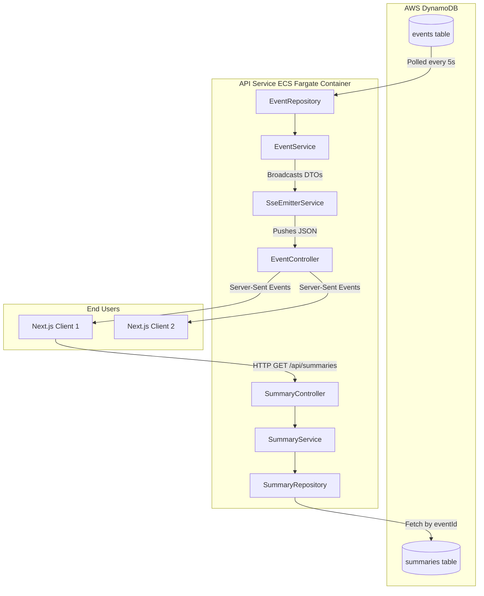

# Phase 4 Completion: API Service Data Flow

Congratulations on completing **Phase 4**! You have built a fully functioning Spring Boot API capable of serving real-time events to your frontend. 

This document breaks down exactly how data flows through the classes you just wrote, from the database all the way to the end user's browser.

> [!TIP]
> **Decoupled Architecture**
> Notice that your API Service never talks to the Producer Service or the Lambda. Everything communicates strictly through AWS managed services (Kinesis, DynamoDB). This means if the API Service crashes, it doesn't affect data ingestion. If the Producer crashes, the API can still serve historical data!

---

## High-Level Architecture

Here is how the API Service fits into your overall infrastructure:

---

## 1. The Real-Time Data Flow (SSE)

The most complex and powerful part of this API is the real-time event pipeline. Let's walk through it step-by-step.

### A. The Client Connects
When a user opens the Next.js dashboard, their browser makes an HTTP `GET` request to `http://localhost:8080/api/events/stream`. 
- This request hits your `EventController`.
- The controller asks the `SseEmitterService` for a new connection object (`SseEmitter`).
- Crucially, **the server does not close the HTTP connection.** It holds it open indefinitely.
- The `SseEmitterService` adds this connection to its thread-safe `CopyOnWriteArrayList`.

### B. The Background Poller Wakes Up
Inside `EventService.java`, you added the `@Scheduled(fixedRate = 5000)` annotation.
- Exactly every 5 seconds, Spring Boot executes the `pollForNewEvents()` method on a background thread.
- It iterates through all 6 `SportType` values.
- For each sport, it calls `eventRepository.findRecentEvents(sportType, lastPollTime)`.

### C. Querying DynamoDB
The `EventRepository` talks to AWS via the `DynamoDbEnhancedClient`.
- It executes a **Global Secondary Index (GSI)** query against the `sport-type-timestamp-index`.
- It asks DynamoDB: *"Give me all items where the partition key is `SOCCER` and the sort key is greater than `1718901234567` (the last time I asked)."*
- Because DynamoDB is a NoSQL database optimized for key lookups, this query takes just milliseconds to run, even if there are millions of historical events.

### D. Transformation
Once the `EventRepository` returns the raw database models (`Event.java`), the `EventService` maps them into a decoupled `EventDto.java`.
- **Why do we do this?** The database model contains `rawPayload`, a massive JSON string representing the original API-Sports payload. The frontend doesn't need this, so the DTO drops it, saving massive amounts of bandwidth when broadcasting to thousands of users!

### E. Broadcasting
The `EventService` hands the DTO to `SseEmitterService.broadcast()`.
- The `SseEmitterService` iterates over every open connection in its list.
- It converts the DTO into JSON and pushes it down the open HTTP pipeline to the browser.
- If a browser was closed, the write operation will throw an `IOException`, and the service safely removes that dead connection from the list.

---

## 2. The REST Data Flow (Commentary)

The AI commentary pipeline is simpler. Because AI generation takes several seconds, we don't broadcast the summaries over the real-time feed. Instead, the frontend fetches them on demand.

### A. The Client Requests a Summary
When a user clicks on an event in the UI (e.g. `eventId: "123-abc"`), the frontend makes an HTTP `GET` request to `/api/summaries/event/123-abc`.
- The `SummaryController` receives this request.

### B. Database Lookup
The controller asks the `SummaryService`, which asks the `SummaryRepository`.
- The repository queries the `event-id-index` GSI in the `summaries` table.
- Since `eventId` is globally unique, this query acts just like a primary key lookup. It returns either exactly `1` item, or `0` items.

### C. Safe Responses
Because it might take Bedrock 5-10 seconds to generate the commentary, the `SummaryRepository` wraps the result in a Java `Optional
`.
- The `SummaryController` handles this safely:
  - If the summary is present, it returns an **HTTP 200 OK** with the `SummaryDto` JSON.
  - If the summary is missing (AI is still thinking), it returns an **HTTP 404 Not Found**.
- The frontend will see the 404 and know to show a "Loading AI Commentary..." spinner, and can automatically retry the request a few seconds later!

---

> [!NOTE]
> **What's Next? Phase 5!**
> You now have a complete backend! Phase 5 is all about building the Next.js frontend to actually consume these APIs. You'll build the UI, configure Cognito for user logins, and write the crucial "Time-Travel Buffer" logic that lets the user sync the live feed to their exact TV broadcast delay.
